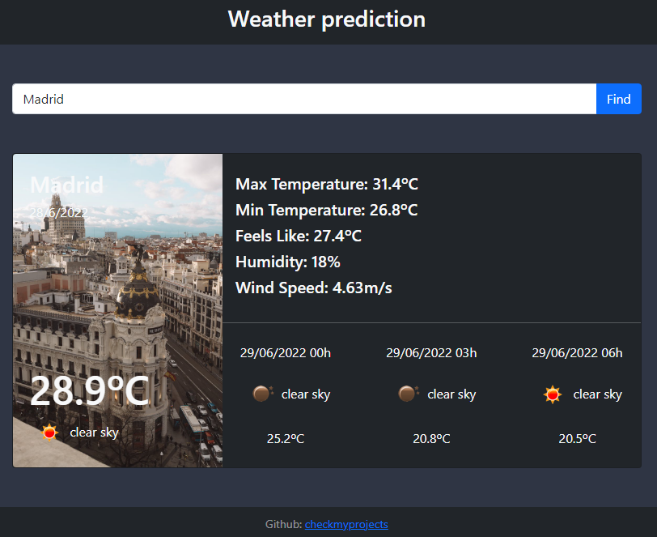

# React Weather App

A quick project to learn some React api stuff.

Made using OpenWeather API https://openweathermap.org/

Live demo at: https://react-my-weather-app.herokuapp.com/

 

## How It's Made:

**Tech used:** HTML, CSS, Javascript, React

A tiny project made as a first contact with react after working with Angular.
It uses the OpenWeather API free plan.

## Optimizations

- I would like to display a picture of the city it displays the weather of, but i couldn't find a free API to do that.

- Make it change theme with local time (day / night).

## Lessons Learned:

React and Angular feel different but have similarities.

I'm not sure if i like React more than Angular, but doing this after having some Angular knowledge made it way easier.

It was a hot day :)